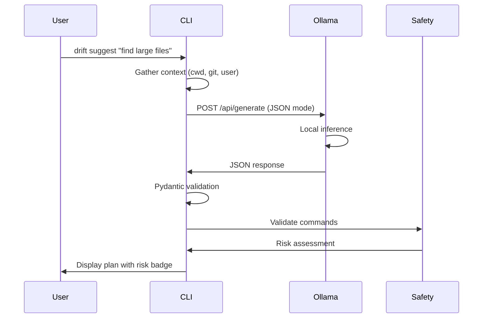

# LLM Integration

Drift uses [Ollama](https://ollama.com) for fully local LLM inference. No API keys, no cloud — your queries never leave your machine.

## How It Works



## System Prompt

Drift sends a structured system prompt that forces JSON output:

```
Role: You are Drift, a terminal assistant.
Task: Convert natural language to shell commands.
Format: Strict JSON matching the Plan schema.
Rules:
  - Assess risk accurately
  - Use clarification_needed for ambiguous queries
  - Provide dry-run versions when possible
  - Never suggest dangerous root operations
```

## JSON Schema

The LLM must respond with JSON matching this schema:

```json
{
  "summary": "Brief description of the plan",
  "risk": "low | medium | high",
  "commands": [
    {
      "command": "the shell command",
      "description": "what this command does",
      "dry_run": "optional safe preview version"
    }
  ],
  "explanation": "Detailed explanation",
  "affected_files": ["list", "of", "files"],
  "clarification_needed": [
    {
      "question": "What directory?",
      "options": ["/home", "/tmp"]
    }
  ]
}
```

Responses are validated with Pydantic. If the JSON is malformed or missing required fields, Drift retries with exponential backoff.

## Supported Models

Any Ollama model works. Recommended:

| Model                 | Size   | Quality | Speed  |
| --------------------- | ------ | ------- | ------ |
| `qwen2.5-coder:1.5b`  | ~1GB   | Good    | Fast   |
| `qwen2.5-coder:7b`    | ~4.5GB | Better  | Medium |
| `codellama:7b`        | ~4GB   | Good    | Medium |
| `deepseek-coder:6.7b` | ~4GB   | Good    | Medium |

## Context Awareness

Before querying the LLM, Drift gathers context:

- **Current directory** and its contents
- **Git status** (branch, modified files, remote URL)
- **User info** (username, shell)
- **Project type** (detected from files like `package.json`, `pyproject.toml`)
- **Memory** (learned preferences from past interactions)

This context is injected into the prompt so the LLM generates commands appropriate for your environment.

## Input Sanitization

User queries are sanitized before being sent to the LLM:

- Strip control characters
- Limit query length
- Escape potential prompt injection attempts

## Error Handling

| Scenario              | Behavior                             |
| --------------------- | ------------------------------------ |
| Ollama not running    | Shows error, suggests `ollama serve` |
| Model not pulled      | Shows error, suggests `ollama pull`  |
| Invalid JSON response | Retries up to 3 times                |
| Network timeout       | Retries with exponential backoff     |
| Ambiguous query       | LLM returns `clarification_needed`   |
