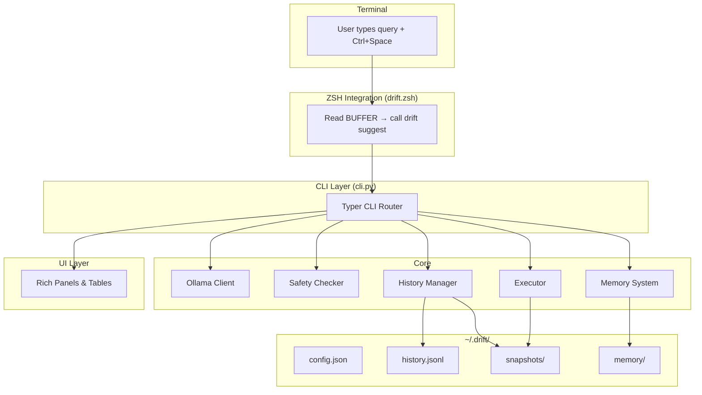

# Architecture Overview

## System Diagram



## Module Breakdown

### `drift_cli/cli.py` — CLI Router

The main entry point. Uses Typer to define all commands (`suggest`, `find`, `explain`, `history`, `again`, `undo`, `doctor`, `version`). Orchestrates calls between core modules.

### `drift_cli/models.py` — Data Models

Pydantic models for structured data:

- `RiskLevel` — Enum: LOW, MEDIUM, HIGH
- `Command` — Single shell command with description and dry-run alternative
- `Plan` — Complete execution plan from LLM (summary, risk, commands, explanation)
- `HistoryEntry` — Stored command history record
- `ClarificationQuestion` — For when the LLM needs more info

### `drift_cli/core/ollama.py` — LLM Client

Communicates with the local Ollama instance:

- Forces JSON output format matching the `Plan` schema
- Provides context-aware system prompts
- Retry logic for transient failures
- Input sanitization before querying

### `drift_cli/core/safety.py` — Safety Engine

The critical safety layer:

- **`HARD_BLOCKLIST`** — 60+ regex patterns for commands that are always blocked
- **`HIGH_RISK_PATTERNS`** — Patterns that trigger HIGH risk
- **`MEDIUM_RISK_PATTERNS`** — Patterns for MEDIUM risk
- **`is_blocked()`** — Checks if a command matches any blocklist pattern
- **`assess_risk()`** — Returns the risk level for a command
- **`validate_commands()`** — Validates a list of commands, returns results

### `drift_cli/core/executor.py` — Command Execution

Executes commands with safety:

- Uses `shlex.split()` + `shell=False` when possible
- Falls back to `shell=True` only for pipes/redirects
- Creates snapshots before file-modifying commands
- Gathers execution context (cwd, git status, user info)

### `drift_cli/core/executor_base.py` — Executor Pattern

Abstract base class with three implementations:

| Executor         | Behavior                        |
| ---------------- | ------------------------------- |
| `MockExecutor`   | Logs commands, never executes   |
| `LocalExecutor`  | Executes in a sandbox directory |
| `DockerExecutor` | Executes inside a container     |

### `drift_cli/core/history.py` — History & Snapshots

- JSONL-based append-only history
- File snapshot creation and restoration
- Path traversal protection
- Auto-rotation when history exceeds max entries

### `drift_cli/core/memory.py` — Memory System

Learns and stores user preferences:

- Tool preferences (e.g., `grep` → `ripgrep`)
- Project-specific context
- Risk tolerance patterns
- Prompt enhancement based on learned history

### `drift_cli/ui/display.py` — Rich UI

Terminal UI built with Rich:

- Color-coded risk badges
- Plan panels with command tables
- Confirmation prompts (y/N for LOW, type YES for HIGH)
- History tables
- Execution result display

## Core Workflow

```
1. Get context (cwd, user, git info)
2. Query Ollama with structured prompt
3. Validate JSON response (Pydantic)
4. Check safety (blocklist + risk scoring)
5. Display plan (Rich UI)
6. Confirm with user
7. Create snapshot (if modifying files)
8. Execute commands
9. Show results
10. Save to history
11. Learn preferences (memory)
```

## File System

```
~/.drift/
├── config.json           # User configuration
├── history.jsonl         # Command history (append-only)
├── drift.zsh             # ZSH integration script
├── snapshots/
│   └── {uuid}/
│       ├── metadata.json
│       └── {backed-up files}
└── memory/
    └── {preferences data}
```
