# Safety Engine

The safety engine is Drift's most critical component. It ensures that no dangerous command ever runs without explicit, informed user consent — and some commands can never run at all.

## Three-Layer Defense

### Layer 1: Hard Blocklist

60+ regex patterns that **always block** a command, regardless of context:

```python
HARD_BLOCKLIST = [
    r"rm\s+-rf\s+/\s*$",            # rm -rf /
    r"rm\s+-rf\s+/[a-z]+",          # rm -rf /usr, /etc, etc.
    r"sudo\s+rm\s+-rf\s+/",         # sudo rm -rf /
    r"mkfs\.",                        # Format disk
    r"dd\s+if=.*of=/dev/",          # Overwrite device
    r":\(\)\{.*\}",                   # Fork bomb
    r"curl.*\|\s*(ba)?sh",           # Pipe curl to shell
    r"wget.*\|\s*(ba)?sh",           # Pipe wget to shell
    # ... 50+ more patterns
]
```

If a command matches any of these, it is **rejected immediately** — no confirmation prompt, no override.

### Layer 2: Risk Assessment

Commands that pass the blocklist are scored:

| Risk                       | When                                       | User Confirmation |
| -------------------------- | ------------------------------------------ | ----------------- |
| **LOW** :green_circle:     | Read-only operations (`ls`, `find`, `cat`) | `y/N` prompt      |
| **MEDIUM** :yellow_circle: | File modifications, package installs       | `y/N` prompt      |
| **HIGH** :red_circle:      | System changes, deletions, `sudo`          | Must type `YES`   |

### Layer 3: User Confirmation

Even after passing the blocklist and risk scoring, **every command requires user confirmation**. High-risk commands require typing "YES" (not just "y").

## How It Works

```mermaid
flowchart TD
    A[LLM generates command] --> B{Matches HARD_BLOCKLIST?}
    B -->|Yes| C[🚫 BLOCKED - Command rejected]
    B -->|No| D{Matches HIGH_RISK?}
    D -->|Yes| E[Risk: 🔴 HIGH]
    D -->|No| F{Matches MEDIUM_RISK?}
    F -->|Yes| G[Risk: 🟡 MEDIUM]
    F -->|No| H[Risk: 🟢 LOW]
    E --> I[Display plan with risk badge]
    G --> I
    H --> I
    I --> J{User confirms?}
    J -->|No| K[Cancelled]
    J -->|Yes| L[Create snapshot → Execute]
```



## Blocklist Categories

| Category              | Examples                           | Count |
| --------------------- | ---------------------------------- | ----- |
| Recursive deletion    | `rm -rf /`, `sudo rm -rf`          | 10+   |
| Disk operations       | `mkfs`, `dd`, `diskutil eraseDisk` | 5+    |
| Remote code execution | `curl \| sh`, `wget \| bash`       | 4+    |
| Fork bombs            | `:(){ :\|:& };:`                   | 2+    |
| Privilege escalation  | `chmod 777 /`, `chown root`        | 5+    |
| Network exfiltration  | `nc -e`, reverse shells            | 5+    |
| Crypto mining         | `xmrig`, `minerd`                  | 3+    |
| System corruption     | `/dev/sda`, `/dev/null` redirects  | 5+    |
| Docker escape         | Container privilege escalation     | 3+    |
| Base64 obfuscation    | `echo ... \| base64 -d \| sh`      | 2+    |

## Testing Safety

```python
from drift_cli.core.safety import SafetyChecker

checker = SafetyChecker()

# This is blocked
assert checker.is_blocked("rm -rf /") == True

# This is safe
assert checker.is_blocked("ls -la") == False

# Risk assessment
risk = checker.assess_risk("pip install flask")
# → RiskLevel.MEDIUM
```

## Adding New Rules

1. Edit `drift_cli/core/safety.py`
2. Add the regex pattern to the appropriate list
3. Add a test in `tests/test_safety.py`
4. Document in this page

```python
# Example: Block a new dangerous pattern
HARD_BLOCKLIST.append(r"my_dangerous_pattern")
```
