# Safe Execution

Drift provides multiple layers of safety so you can test without risk.

## Safety Layers

```mermaid
flowchart TD
    A[User Query] --> B{Hard Blocklist}
    B -->|Blocked| C[❌ Command rejected]
    B -->|Passed| D{Risk Assessment}
    D --> E[🟢 LOW]
    D --> F[🟡 MEDIUM]
    D --> G[🔴 HIGH]
    E --> H[Confirm y/N]
    F --> H
    G --> I[Confirm: type YES]
    H --> J[Create Snapshot]
    I --> J
    J --> K[Execute]
    K --> L[drift undo available]
```



## 1. Dry-Run Mode

See what would happen without executing anything:

```bash
drift suggest "delete all .pyc files" --dry-run
```

Force dry-run globally:

```bash
export DRIFT_DRY_RUN=1
drift suggest "anything"  # Will never execute
```

## 2. Mock Executor

Commands are logged but never run — even if you confirm:

```bash
DRIFT_EXECUTOR=mock drift suggest "reorganize my project"
```

Output:

```
[MOCK] Would execute: mv old_dir/ new_dir/
[MOCK] Would execute: mkdir -p src/
```

## 3. Sandbox Mode

Real execution, but confined to a temporary directory:

```bash
mkdir /tmp/drift-sandbox
DRIFT_SANDBOX_ROOT=/tmp/drift-sandbox drift suggest "create project structure"
```

Commands that try to write outside the sandbox are blocked.

## 4. Docker Isolation

Full container-based isolation (requires Docker):

```bash
DRIFT_EXECUTOR=docker drift suggest "install and test a package"
```

## Programmatic Testing

```python
from drift_cli.core.executor_base import get_executor

# Mock — nothing executes
executor = get_executor("mock")
result = executor.execute("rm -rf /")
print(result.stdout)  # "[MOCK] Would execute: rm -rf /"

# Sandbox — real execution in isolated directory
import tempfile
from pathlib import Path
sandbox = Path(tempfile.mkdtemp())
executor = get_executor("local", sandbox)
executor.execute("touch test.txt")  # Only inside sandbox
```

## Safety Checklist

| Scenario                        | Recommended Mode                  |
| ------------------------------- | --------------------------------- |
| First time trying Drift         | `--dry-run`                       |
| Testing on a production machine | `DRIFT_EXECUTOR=mock`             |
| Want to see real output safely  | `DRIFT_SANDBOX_ROOT=/tmp/sandbox` |
| Maximum isolation               | `DRIFT_EXECUTOR=docker`           |
| Normal daily use                | Default (confirm before execute)  |

!!! warning "Always review"
No matter which mode you use, **always read the generated command** before confirming. The safety engine catches most dangers, but you are the final gate.
